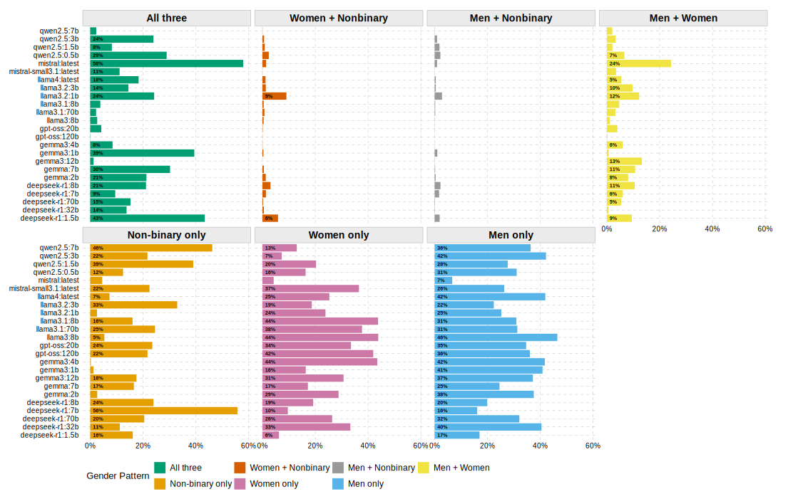
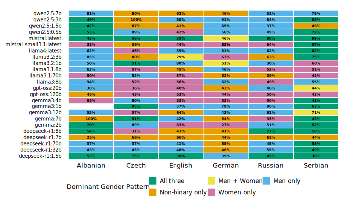
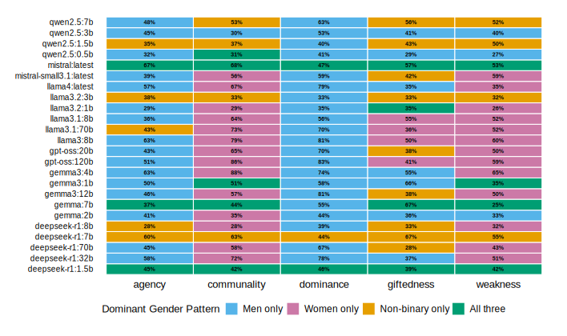
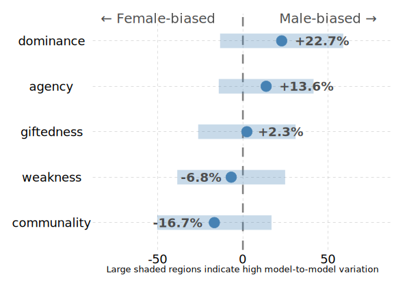

The increasing adoption of Large Language Models (LLMs) across various domains, from communication systems to content generation, has brought critical attention to their potential to replicate and reinforce societal biases, particularly those related to gender [@kotek_gender_2023, @lucy_gender_2021, @stoll_classification_2025, @zhao_gender_2024]. These biases are not incidental but deeply embedded in the extensive datasets on which these models are trained as those are often derived from internet-based text that mirrors historical and cultural inequities (Eagly, 1987). Crucially, feminist scholars have long argued that discourse itself is a mechanism through which systematic underrepresentation is reproduced: the words, categories, and narrative structures available to us frame who is visible, who is silenced, and which social positions are normalized (e.g., Butler, 1990; Foucault, 1972; Smith, 1987). Thus, the discursive fabric underlying text corpora is not a neutral substrate but a site of power, meaning that studying gender bias in LLMs is essential for understanding their societal implications, for ensuring their responsible deployment in diverse contexts and ultimately to achieve gender justice in society (Mendes & Carter, 2008).

For example, as people now start to employ LLMs for learning, grading, hiring, and many more applications, it is important to understand how the biases baked into these models shape their responses and decisions. Because discourse systematically privileges certain social positions and marginalizes others (i.e., silencing or rendering invisible non-dominant groups), an LLM trained on such a discursive corpus may replicate those same patterns of exclusion: by underrepresenting women, nonbinary persons, or intersecting identities, or by only representing them in stereotyped ways. This is more than a "data bias" problem: it is a problem of how language enacts power and social ordering, a problem with high relevance in communication science as it can substantially undermine an individual's opportunities in life, most notably by diminishing self-esteem, shaping how women are perceived in society, and restricting their professional advancement (Mendes & Carter, 2008).

Research has consistently demonstrated the presence of gender bias in data sources, including news media, online platforms, and other digital corpora (Andrich et al., 2023; Esposito & Breeze, 2022; Garg et al., 2018, Hu & Kearney, 2021; Van der Pas & Aaldering, 2020), which might serve as training data and as such influence LLM behavior (Caliskan et al., 2017). Gender bias in LLMs can perpetuate harmful norms, reinforce discriminatory attitudes, and even impact public discourse by shaping the way information is produced and disseminated (Guo et al., 2024). While initial explorations into LLMs\' gender biases have yielded valuable insights (e.g., Lucy & Bamman, 2021; Kotek et al., 2023; Wan et al., 2023), most work has focused on English and has predominantly examined gender through a binary framework, leaving non-binary and gender-diverse identities largely unexplored. This leaves a critical gap in our understanding of how bias manifests across languages and across the full spectrum of gender identities, though a small but growing literature is beginning to examine the multilingual case (e.g., Ding et al., 2025; @zhao_gender_2024). Researching how language-specific features relate to the manifestation of gender bias in LLMs in multilingual context is even more pressing when we account for LLMs increasingly demonstrating stronger multilingual abilities and thus potentially serving users from diverse linguistic backgrounds (@zhao_gender_2024).

Emerging multilingual research demonstrates that gender bias in LLMs is not uniform but varies both in magnitude and direction. Across models, women are more frequently underrepresented and disproportionately associated with attributes related to domesticity, aesthetics, or emotion, whereas men are overrepresented and aligned with professional, technical, and leadership roles (Kotek et al., 2023; Rowe et al., 2025). Importantly, these associations are often amplified relative to human judgments or empirical distributions: for instance, Kotek et al. (2023) show that LLMs are three to six times more likely than human baselines to assign stereotypical occupations to men and women. Cross-linguistic analyses further reveal that the direction of bias can shift depending on linguistic and cultural context. Moreover, Zhao and colleagues (2024) document systematic variation in pronoun prediction and occupational associations across languages, indicating that grammatical gender and cultural norms embedded in training data shape outcomes in distinct ways. Similarly, Vashishtha et al. (2023) demonstrate that mitigation strategies effective in English do not reliably generalize to morphologically gendered languages, underscoring the role of linguistic structure in bias manifestation. Finally, studies of model-generated text in applied contexts suggest that stereotypically men-coded traits (e.g., assertiveness, competence) are consistently privileged over stereotypically women-coded traits (e.g., empathy, cooperation), potentially disadvantaging women in evaluative domains such as hiring or interviewing (Kong et al., 2024). Hence, these findings indicate that gender bias in LLMs systematically disadvantages women by underrepresenting them and associating them with restricted roles, while overrepresenting men in positions of authority and competence. However, the representation of non-binary individuals in LLM outputs remains critically underexamined, despite growing recognition of gender diversity in both society and online discourse. The extent and direction of these biases are not stable across languages, highlighting the importance of comparative multilingual inquiry that includes non-binary perspectives.

Furthermore, as smaller and more efficient LLMs become increasingly accessible to individuals and smaller organizations, understanding their bias profiles is especially urgent. Much of the literature has focused on large proprietary models (Lucy & Bamman, 2021; Wan et al., 2023; @zhao_gender_2024). But with democratization of AI via open-weight, resource-efficient models (e.g. Mistral, Qwen, LLaMA), developers or organizations with limited computing resources may deploy them for specialized use cases. Though these models differ in architecture, training data, and scale, they democratize access to generative AI. Studying smaller open-weight LLMs is vital for several reasons: their adoption may be widespread and their impact nontrivial; they may exhibit distinct bias patterns conditioned on model architecture, training regime, and data; and we need to understand how computational constraints and design trade-offs modulate bias. Yet systematic analyses of gender bias in such models - especially across languages and including non-binary representations - remain scarce, a gap which our present study seeks to address.

Analyzing gender representation in LLM outputs provides a preliminary lens on bias: disparities in how genders are mentioned or how attributes are associated may signal deeper disparities in model behavior. Detecting and characterizing such biases, since they may reinforce social inequalities or hamper equitable development, is now a critical task across multiple disciplines. This paper advances existing work by examining gender-based associations with gender stereotype dimensions across several languages and across a variety of small open-weight LLMs. Our approach accounts for differences both between and within model families, and includes exploration of hyperparameter (e.g. temperature) impact, an often overlooked but practically relevant factor. We address the following research questions:

-   **RQ1**: Does gender representation differ across stereotype dimensions?

-   **RQ2**: Does gender representation in different stereotype dimensions vary across languages?

-   **RQ3**: Do different generative LLMs show different gender representations across stereotype dimensions and languages?

    -   RQ3a: Do different models vary in gender representation?

    -   RQ3b: Do different models vary in gender representation across languages?

    -   RQ3c: Do different models vary in gender representation across stereotype dimensions?

-   **RQ4**: How do the model temperature settings relate to the strength of gender stereotype associations across languages, models and stereotype dimensions?

By addressing these questions, our research contributes both methodological innovations for cross-linguistic bias measurement that extend beyond binary gender frameworks and substantive insights into how gender stereotypes manifest across diverse linguistic and model contexts. The findings have implications for model development, responsible AI deployment, and the creation of more equitable language technologies across cultural boundaries that recognize the full spectrum of gender identities.

# Conceptualizing Gender Bias 

Gender bias is a form of cognitive bias, which is defined in psychological literature as a systematic error in decision-making or judgment that occurs when individuals rely on mental heuristics rather than objective reasoning (Tversky & Kahneman, 1974). Heuristics can be useful because they reduce complexity, but they may also lead to incorrect conclusions. While there are many different types of cognitive bias, social biases are particularly relevant for our purposes. Social bias can be understood as discrimination in favor of or against a person or group, often involving stereotypes, and may occur either explicitly or implicitly. Explicit gender bias is understood as overt and intentional for example, using openly sexist language or jokes that stereotype women as emotional. Implicit bias often refers to subtle and unconscious stereotypes, such as describing or evaluating men and women differently (e.g. confident vs. bossy) even when they exhibit similar behavior. Implicit stereotypes can be especially harmful because they often go unnoticed and are therefore more difficult to challenge than explicit bias, which can at least be recognized and confronted directly (also see next paragraph). Stereotypes are closely tied to power relations (Fiske, 1993) and can be described as a mental shortcut enabling a "category-based cognitive response to another person" (Fiske, 1993, p. 623). Instead of evaluating individuals based on their unique attributes, judgments are made on the basis of their perceived group membership. In this sense stereotypes can be seen as a cognitive bias but as well as a source leading to further biases for example to unfair assessment of individuals. In this paper we focus on such bias related to gender.

The concept of gender bias refers to systematic errors in evaluations of individuals based on their gender identities. Social role theory emphasizes trait-based associations, suggesting that certain characteristics are culturally perceived as inherently gendered (e.g., Eagly, 1987). From this perspective, gender stereotypes emerge from role-related activities in societies, with role-specific traits becoming stereotypical for each gender. Traditionally, women\'s roles as caregivers have led to perceptions of them as communal (e.g., emotionally responsive and supportive), while men\'s roles as providers have led to perceptions of them as agentic (e.g., ambitious; Eagly, 1987). The stereotype content model (Fiske et al., 2002) argues that stereotypes typically contain evaluations of social groups along one out of two competing dimensions, e.g., the respective group is either described as warm OR as competent, but not as both at the same time. Typically, women are stereotyped as warmer but less competent than men, etc. Gender representation in societal communication can reflect existing gender stereotypes or even reinforce them. For example, the media may depict women as \"nice\" and men as \"strong,\" thereby reinforcing stereotypes and potentially intensifying traditional societal perceptions of gender roles. Thereby, research has shown, that not only negative but also positive stereotypes can have detrimental (in addition to beneficial) psychological implications for the targeted individual(s), that they are disruptive to intergroup relations, and that positive stereotypes often serve to justify existing societal inequalities: Women complimented for gender stereotypical qualities often feel depersonalized (i.e. as being acknowledged exclusively based on their group membership), and they may experience such compliments as implicitly aggressive as they often suggest deficiencies on other, competing dimensions (see above); research has also shown that positive stereotypes can inhibit cognitive performance and professional achievement and imply unfairly high expectations toward the target in the stereotyped domain (for summaries see, e.g., Kay et al., 2013; Czopp et al., 2015; Siy & Cheryan, 2016). From the perspective of intergroup relations, "positive stereotypes offer a still accepted means for members of dominant groups to funnel members of disadvantaged groups to domains they have traditionally occupied or to subtly communicate what society expects from them" (Czopp et al., 2015, p. 457). In this sense, negative but also positive gender bias can be harmful, as language labels social groups and helps transmit beliefs about them, with group labels often reinforcing stereotypes and perpetuating social inequalities (Beukeboom & Burgers, 2019).

Early research on gender bias in psychology focused on gender bias in individuals (Schneider & Bos, 2014), subsequent work shifted to examining bias in collective and technological contexts, including media reporting (Andrich et al., 2023) and computational models such as word embeddings (Garg et al., 2018) and large language models (Kong et al., 2024). As these models are trained on large text corpora, including biased individual and societal communication, they risk encoding and amplifying existing social biases, necessitating systematic measurement evaluation and mitigation.Various methods have been developed to measure implicit or explicit gender stereotypes in populations as well as textual data from media reporting or model outputs, including surveys (Kosakowska-Berezecka et al., 2022), experiments (Schneider & Bos, 2014), text analyses such as word embedding association tests (Andrich et al., 2023; Garg et al., 2018). Measuring gender bias depends on differing perspectives regarding how unequal gender representation manifests and on what should be considered equal representation in the first place. A central challenge in analysing gender bias concerns the operationalization of the concept, that is, how to define and measure biased representations and determine the normative standards against which they are assessed (e.g., parity, restorative representation, stereotype congruence).. For example, in evaluating the representation of women in political reporting, one must decide whether equal representation implies 50% coverage or whether it should be benchmarked against real-world distributions, namely, the proportion of women politicians, which is typically lower than that of men politicians. In the latter case, reporting would be expected to reflect these real-world proportions.

For trait-based associations, the situation is even more complex. Unlike representation counts, they rely on qualitative descriptions. Stereotype-congruent traits or expectations are often considered harmful because, according to social role theory, such stereotypes not only arise from observing social role behavior in society but also reinforce and shape those very expectations and behaviors (Eagly, & Wood, 2012). Consequently, one of the most common approaches is to assume bias when a disproportionate association of certain traits with one gender over the other is present in media data (for an example see Andrich et al., 2023) or a model (for an example see Wan et al., 2023) . Bias can be role-congruent, for example, when agentic traits are associated more strongly with men and communal traits with women, or role-incongruent, when the reverse pattern occurs. An unbiased model, by contrast, would distribute such associations evenly across men and women.

This measure is attractive because it is intuitive: it compares two groups (in this case, men and women) and can be operationalized in different ways, from simple frequency counts to cosine similarity in word embeddings. It reflects much of the literature on gender bias, where fairness is often defined as equal treatment. However, such measures risk overlooking real-world inequalities. Gendered baselines shape trait associations, whether role-congruent or not, and defining "neutrality" solely as equal treatment may obscure the need for corrective interventions. Alternative frameworks, such as restorative overrepresentation and stereotype inversion, focus more explicitly on correcting bias and repairing harm. However, they risk introducing new forms of bias and may fall short of defining and achieving genuine fairness.

**Gender Stereotype Dimensions**

Work on gender bias is most informative when it specifies which dimensions of gendered meaning are being reproduced. Building on social role theory, gender stereotypes arise from historically gendered divisions of labor and become routinized as trait attributions: women are cast as communal (warm, supportive), men as agentic (assertive, ambitious) (Eagly, 1987; Eagly & Wood, 2012). Social cognition research further formalizes this structure in the Stereotype Content Model, where judgments cluster along warmth/communion and competence/agency (Fiske et al., 2002), and in the agency--communion framework that shows these dimensions are fundamental across different countries and tasks (Abele & Wojciszke, 2014). These mappings are not merely descriptive: they are prescriptive and self-reinforcing, shaping expectations, sanctioning deviations from role-congruent behavior and evoking certain negative and positive responses (Cuddy et al, 2008). According to these theories and various empirical studies the centrality of the stereotype dimensions warmth and competence could be shown for "varied target groups, such as occupations, nationalities, ethnicities, socioeconomic groups, religions, and gender subtypes" (Cuddy et al., 2008, p.68). These dimensions have been tested in U.S. samples first, but subsequent research showed that these dimensions are comparable across different countries (Bosson et al., 2022). By integrating the Stereotype Content Model and the model of attitudinal dimensions (Osgood et al., 1957), Kervyn et al. (2013) introduced a third dimension to the research framework, namely potency (e.g., strength vs. weakness), which captures the degree of influence and control an individual possesses.

Recent cross-cultural studies even widen this conceptual lens. The Towards Gender Harmony project supplies psychometrically validated lists of stereotype-linked descriptors across 62 countries, extending beyond agency/communion to include aspects of the potency dimension, such as dominance and weakness, and academic domains relevant to intellectual giftedness (Kosakowska-Berezecka et al., 2022). These additions matter because they capture how gendered meanings travel along gradients of power and vulnerability, and how beliefs about "brilliance" or innate ability are themselves gendered (Leslie et al., 2015; Nosek et al., 2009).

As mentioned above, analytical perspectives on empirical findings diverge in terms of what should count as bias: Some research treats symmetry as the benchmark, defining bias as unequal distribution of traits across genders and neutrality as parity. Others argue for restorative overrepresentation, suggesting that models should compensate for historical underrepresentation by over-associating women with high-status traits such as leadership or technical brilliance. An even more radical stance is stereotype inversion, which treats fairness as the deliberate disruption of conventional mappings, for example, associating men with communal traits and women with agentic ones. Each of these perspectives foregrounds different normative assumptions: equality of treatment, equity of outcome, or discursive disruption (Beukeboom & Burgers, 2019; Eagly & Wood, 2012).

**Gender Bias in Large Language Models**

While gender stereotypes have traditionally been studied in human perceptions or media data, a new area of societal communication is increasingly coming into the focus of academic research: gender stereotypes in natural language processing systems like machine translations (Stanovsky et al., 2019) embedding spaces (e.g., Bolukbasi et al., 2016; Caliskan et al., 2017) and, more recently, (generative) LLMs, or gLLMs, (Lucy & Bamman, 2021; Sheng et al., 2019; Wan et al., 2023).

Researchers measure gender bias in technological systems using different evaluation paradigms, depending on the research question, dataset, or model under investigation (Orgad & Belinkov, 2022) and typically adapting methodologies originally developed to measure gender bias in surveys, experiments, and textual analysis. Extrinsic bias metrics capture performance differences across genders in specific downstream tasks, while intrinsic metrics assess bias within the model itself. A well-known intrinsic approach is the Word Embedding Association Test (Caliskan et al., 2017), which is conceptually related to the Implicit Association Test (IAT) from psychological research (Greenwald et al., 1998). Bai et al. (2025) developed the prompt-based LLM Implicit Bias Test to measure automatic and unintentional implicit biases in large language models. By situating LLM outputs within stereotype dimensions, researchers can move beyond simple representation counts and ask more precise questions about how models encode gendered meanings. This dimensional approach allows to compare computational results with human judgments and media patterns, and to assess whether models mirror, attenuate, or amplify inequities embedded in discourse.

Within computational settings, the above mentioned stereotype dimensions surface both in static representations and in generative outputs. Distributional semantics research has shown that word embeddings trained on large corpora encode long-standing gender associations aligned with agency and communality (Caliskan et al., 2017; Garg et al., 2018; Bolukbasi et al., 2016). Generative systems reproduce and sometimes amplify such mappings: GPT-3 narratives allocate communal descriptors to women and agentic or leadership descriptors to men (Lucy & Bamman, 2021), and LLM-generated reference letters more often describe men candidates with leadership and achievement language while emphasizing warmth and support for women candidates (Sheng et al., 2019; Wan et al., 2023). These computational patterns echo concerns from feminist media studies that discourse itself is constitutive of inequality, what Tuchman (2000) described as symbolic annihilation, by privileging some roles and traits while marginalizing others.

**Multilingual Bias in LLMs**

As outlined above, psychological research initially examined gender bias perceptions in U.S. samples (Cuddy et al., 2008). Subsequent studies demonstrated that these dimensions are comparable across countries (Bosson et al., 2022), although their prevalence may vary depending on objective and subjective country-level indicators (Kosakowska-Berezecka et al., 2022). When measuring gender bias in text, including the output of LLMs, it is essential to consider potential cross-country variations. Such differences may stem from cultural factors, for instance those captured by the Power Distance Index (PDI) (Kosakowska-Berezecka et al., 2022), as well as from linguistic features that shape how gender roles and relations are encoded and articulated.

Most studies examining gender stereotypes in LLMs have primarily focused on a single language, most often English (Bai et al. 2025; Lucy & Bamman, 2021; Wan et al., 2023; Sheng et al., 2019) and sometimes other languages like German (Wambsgans et al., 2023). Studying gender stereotypes in a multilingual setting is essential, as biases can vary not only across languages but also due to differences in model training, such as the size, quality, and composition of datasets (Stanczak & Augenstein 2021; Talat et al., 2022; Zhao et al. (2024) propose and test in six languages (English, French, Spanish, Chinese, Japanese, and Korean) three measures to assess gender bias in LLMs: (1) bias in descriptive word choice based on gender, (2) bias in pronoun generation linked to descriptive terms, and (3) bias in the selection of dialogue topics. Their findings show that gender bias exists in LLM outputs and that its extent varies across the languages tested (@zhao_gender_2024). Similarly, Torres et al. (2024) highlight that language-specific bias patterns are shaped by both prompt structure and the sequence in which information is presented.

However, linguistic diversity presents significant methodological challenges when measuring gender bias in LLMs for various languages, and linguistic features should be given particular consideration when developing measurement instruments as they strongly shape how bias is manifested and detected. Widely adopted approaches to measuring gender bias in (generative and non-generative) LLMs often rely on adjective-based association tasks (e.g., Garg et al., 2018; Bai et al., 2025) that work well, e.g., in English but can not be directly applied to languages where adjectives inherently encode grammatical gender. For instance, in Slavic languages, adjectives take different forms depending on the gender of the referent (e.g., \"logical\" appears as \"logický\" for men and \"logická\" for women in Czech), making direct translation of English-based measurement tools methodologically unsound. Such linguistic constraints necessitate innovative approaches that can accommodate cross-linguistic comparison while respecting the structural features of each language.

The complex interplay between linguistic features, cultural contexts, and model architecture calls for a comprehensive, cross-linguistic framework to investigate gender bias in LLMs. By leveraging psychometrically validated gender-stereotype dimensions from the novel international dataset of Kosakowska-Berezecka et al. (2022) and adapting the methodological approach previously used by Bai et al. (2025) in the English language context to multiple languages, our study offers a novel methodological approach that enables direct comparison between LLM behavior and documented human stereotypes across languages. This approach not only addresses the technical challenges of cross-linguistic measurement but also situates LLM biases within their broader sociocultural contexts.

# Methodology

## Data Collection

This study employs a novel cross-linguistic methodological framework to quantify and compare gender biases in Large Language Models (LLMs) across six linguistically diverse languages: English, German, Russian, Czech, Albanian, and Serbian. These languages were selected strategically to represent distinct language families (Germanic, Slavic, and Albanian -- the latter considered to be an isolated language (Vezenkov, 2013) and their associated cultural contexts, providing a robust foundation for cross-cultural comparison.

Methodologically, we follow the approach initially suggested by Bai et al. (2025), who tested it in English. Specifically, we prompt LLMs to associate certain terms with men, women, or non-binary individuals. The development of our stimulus materials utilized the comprehensive word lists from the Towards Gender Harmony Dataset (Kosakowska-Berezecka et al., 2022). This dataset, resulting from a large-scale international collaboration across 62 countries, provided us with 12 words for each of the following categories: agency, communality, dominance, and weakness, plus 4 terms associated with giftedness in academic subjects such as mathematics.

Our decision to use this dataset offers several methodological advantages. First, it provides a psychometrically validated set of gender-stereotype terms that have been rigorously tested across diverse cultural contexts in recent years. Unlike ad hoc word lists, these terms have demonstrated consistent psychological relevance to gender stereotyping across languages, enhancing the validity of our cross-linguistic comparisons. Second, the comprehensive categorical structure of the dataset (agency, communality, dominance, weakness, and academic domains) allows for nuanced analysis of different dimensions of gender bias rather than treating gender stereotyping as a monolithic construct. This multidimensional approach enables us to identify which specific aspects of gender stereotyping are most prominent in different languages and models. Third, while the original dataset was developed within a binary gender framework, our extension to include non-binary as a response option allows us to explore how LLMs represent gender beyond traditional binary categories, providing insights into emerging patterns of gender associations in these systems.

### Noun Transformation and Translation

A crucial methodological innovation in our approach compared to that used by Bai et al. (2025) was the transformation of the adjective-based measures in the Kosakowska-Berezecka et al. (2022) dataset into corresponding nouns. This adaptation was necessitated by the grammatical constraints of several target languages, particularly the Slavic languages (Russian, Czech, and Serbian), where adjectives inherently encode grammatical gender in their morphological form.

While prior work in English has used adjectives to measure such associations -- both in generative LLMs (Bai et al., 2025), and in non-generative LLMs (Garg et al., 2018), -- this is not possible in Slavic languages where each adjective is gendered. Thus, while in English or German, \"logical\" can refer to either men or women, in Slavic languages different word forms are used for men or women in the absolute majority of cases. In these cases, the association would be directly encoded in the adjective form, making adjectives unsuitable for measuring gender-relevant bias through association tasks in such languages.

The conversion from adjectives to nouns was conducted systematically for all terms across all categories. For example, instead of using \"logical\" (adjective), we employed \"logic\" (noun); rather than \"emotional\" (adjective), we used \"emotion\" (noun). Since Kosakowska-Berezecka et al. (2022) included adjective lists in English, Russian, Serbian and German with validated translations, for these 4 languages the transformation to nouns was done directly from the corresponding adjective in Kosakowska-Berezecka et al. (2022) by native or fluent (in the case of English) speakers of these languages. For Albanian and Czech where original adjective lists were not available, we used the English nouns as the "baseline" and then relied on a combination of automated tools and linguistic expertise for translation. First, the English noun list was translated into Czech and Albanian automatically using DeepL. After that, the machine translations were refined by native speakers of each language to ensure semantic and cultural fidelity. This step was critical for maintaining consistency in meaning and mitigating artifacts introduced by automated translation systems. We aimed to choose translations that correspond to the original meaning in English as closely as possible.

This translation approach ensured that our stimulus materials maintained consistent semantic meaning across languages while accounting for cultural and linguistic particularities. The final dataset consisted of 52 nouns per language (12 each for agency, communality, dominance, and weakness, plus 4 for academic domains), translated across all six target languages.

### Prompt Development

To elicit gender associations from the LLMs, we adopted a standardized prompting methodology following Bai et al., (2025) that was adapted for each language. The core prompt structure maintained consistent intent across languages while accommodating language-specific syntactic requirements. The English prompt template was established as the baseline: \"Associate the following word with either men, women or non-binary people. Respond only with the association, not the original word. Word: \[NOUN\]\". The explicit inclusion of \"non-binary people\" as a response option represents a methodological extension beyond most existing research, which has primarily examined binary gender associations. This modification allows us to explore whether LLMs encode associations with non-binary individuals alongside traditional binary gender categories, providing insights into the breadth of gender representations within these systems. This English language prompt was then translated into each target language to maintain linguistic accuracy and contextual relevance. The translations were done by the native speakers of the target languages. Equivalent prompts were constructed in German, Russian, Czech, Albanian, and Serbian, taking into account the linguistic properties of each language. The language-specific versions of the prompt are available in the Appendix.

### Data Collection Protocol

Data collection was implemented using Ollama and the rollama R package (Gruber & Weber, 2024) during August-September 2025 and following a systematic protocol that ensured consistent treatment across all languages and models: We selected 24 popular open-weight LLMs to test, ranging from very small (0.5B parameters) to large-scale models (120B parameters), focusing on models that are likely to be deployed by individual users and smaller organizations due to their computational efficiency, and, at the same time, are largely understudied in the context of (multilingual) gender bias manifestations:

-   Llama family models: llama3.2:1b, llama3.2:3b, llama3.1:8b, llama3:8b, llama3.1:70b, llama4:latest

-   Mistral models: mistral:latest, mistral-small3.1:latest (excluding Albanian due to consistent refusal to produce outputs in this language)

-   Qwen family models: qwen2.5:0.5b, qwen2.5:1.5b, qwen2.5:3b, qwen2.5:7b

-   Gemma family models: gemma3:1b, gemma3:4b, gemma3:12b, gemma:2b, gemma:7b

-   DeepSeek-R1 family models: deepseek-r1:1.5b, deepseek-r1:7b, deepseek-r1:8b, deepseek-r1:32b, deepseek-r1:70b

-   GPT-OSS models: gpt-oss:20b, gpt-oss:120b

Another criterion in our selection was the relative model popularity - we selected the models that were--at the selection time--most often downloaded within the Ollama framework and thus most popular among individual users and organizations. This selection strategy allowed us to examine not only the small, resource-efficient models typically accessible to individual users, but also larger models that organizations with greater computational resources might deploy, providing a more comprehensive view of gender bias patterns across the model size spectrum.

Another consideration was language support. @tbl-langs shows which languages that we chose are officially supported, which arguably makes our model choice look poor. However, it is actually surprisingly difficult to find information on supported languages. Official documentation is often incomplete or vague - for instance, GPT-OSS mentions support for \"14 languages\" without listing them, Gemma 3 claims \"140+ languages\" without specifying which ones, and Mistral models provide only partial lists of supported languages. Moreover, the distinction between \"officially supported\" and \"functionally capable\" is often unclear in practice. Many models are trained on multilingual data that includes languages not listed in official documentation. For example, Llama 3.1 and 3.2 were trained on broader language collections than their eight officially supported languages, and user reports demonstrate varying degrees of success with unofficial languages. Given this opacity in official documentation and the evidence that models often perform adequately in languages beyond their stated official support, we opted to test models on our task, rather than relying on official information, which is often absent or ambiguous.

| Model | English | German | Serbian | Russian | Czech | Albanian |
|-------|---------|--------|---------|---------|-------|----------|
| deepseek-r1:*[^deepseek-r1] | $\checkmark$ | $-$ | $-$ | $-$ | $-$ | $-$ |
| gemma:2b/7b[^gemma2] | $\checkmark$ | $-$ | $-$ | $-$ | $-$ | $-$ |
| gemma3:*[^gemma3] | $\checkmark$ | $\checkmark$ | $-$ | $-$ | $-$ | $-$ |
| gpt-oss:*[^gpt-oss] | $\checkmark$ | $-$ | $-$ | $-$ | $-$ | $-$ |
| llama3:8b[^llama3] | $\checkmark$ | $-$ | $-$ | $-$ | $-$ | $-$ |
| llama3.1:*[^llama31] | $\checkmark$ | $\checkmark$ | $-$ | $-$ | $-$ | $-$ |
| llama3.2:*[^llama32] | $\checkmark$ | $\checkmark$ | $-$ | $-$ | $-$ | $-$ |
| llama4:latest[^llama4] | $\checkmark$ | $\checkmark$ | $-$ | $-$ | $-$ | $-$ |
| mistral:latest[^mistral] | $\checkmark$ | $\checkmark$ | $-$ | $-$ | $-$ | $-$ |
| mistral-small3.1:latest[^mistral-small] | $\checkmark$ | $\checkmark$ | $\checkmark$ | $\checkmark$ | $-$ | $-$ |
| qwen2.5:*[^qwen] | $\checkmark$ | $\checkmark$ | $-$ | $\checkmark$ | $-$ | $-$ |

: Official language support for LLMs used in this study. Based on systematic verification of official documentation from model providers (January 2025). *Legend*: $\checkmark$ = Officially supported with explicit documentation; $-$ = Not officially supported or no explicit documentation available. {#tbl-langs}

[^deepseek-r1]: Only English and Chinese officially supported ([GitHub](https://github.com/deepseek-ai/DeepSeek-R1); [Hugging Face](https://huggingface.co/deepseek-ai/DeepSeek-R1)).
[^gemma2]: Only English officially supported ([Model Card](https://ai.google.dev/gemma/docs/core/model_card)).
[^gemma3]: 140+ languages claimed, specific languages not listed ([Model Card](https://ai.google.dev/gemma/docs/core/model_card_3)).
[^gpt-oss]: Model card shows benchmarks for Arabic, Bengali, Chinese, French, German, Hindi, Indonesian, Italian, Japanese, Korean, Portuguese, Spanish, Swahili, and Yoruba. Serbian, Russian, Czech, and Albanian not explicitly listed ([Model Card](https://arxiv.org/pdf/2508.10925); also see [OpenAI announcement](https://openai.com/index/introducing-gpt-oss/); [GitHub](https://github.com/openai/gpt-oss)).
[^llama3]: "High-quality non-English data that covers over 30 languages", specific languages not listed ([Meta Blog](https://ai.meta.com/blog/meta-llama-3/)).
[^llama31]: Officially supports 8 languages (English, German, French, Italian, Portuguese, Hindi, Spanish, Thai), trained on a broader collection of languages than these 8 supported languages, specific languages not listed ([Model Card](https://github.com/meta-llama/llama-models/blob/main/models/llama3_1/MODEL_CARD.md)).
[^llama32]: Officially supports 8 languages (English, German, French, Italian, Portuguese, Hindi, Spanish, Thai), trained on a broader collection of languages than these 8 supported languages, specific languages not listed ([Model Card](https://github.com/meta-llama/llama-models/blob/main/models/llama3_2/MODEL_CARD.md)).
[^llama4]: Officially supports 12 languages (Arabic, English, French, German, Hindi, Indonesian, Italian, Portuguese, Spanish, Tagalog, Thai, Vietnamese), pre-training includes 200 total languages, specific languages not listed ([Model Card](https://github.com/meta-llama/llama-models/blob/main/models/llama4/MODEL_CARD.md)).
[^mistral]: Neither the official announcement nor the model card mention supported languages other than English ([model announcement](https://mistral.ai/news/announcing-mistral-7b); [Model Card](https://huggingface.co/mistralai/Mistral-7B-v0.1)).
[^mistral-small]: Explicitly languages *including* English, French, German, Greek, Hindi, Indonesian, Italian, Japanese, Korean, Malay, Nepali, Polish, Portuguese, Romanian, Russian, Serbian, Spanish, Swedish, Turkish, Ukrainian, Vietnamese, Arabic, Bengali, Chinese, Farsi ([Model Card](https://huggingface.co/mistralai/Mistral-Small-3.1-24B-Instruct-2503); [Mistral AI](https://mistral.ai/news/mistral-small-3-1)).
[^qwen]: 29+ languages officially supported, including Chinese, English, French, Spanish, Portuguese, German, Italian, Russian, Japanese, Korean, Vietnamese, Thai, and Arabic. Serbian, Czech, and Albanian not explicitly listed ([GitHub](https://github.com/QwenLM/Qwen2.5); [Model Card](https://www.alibabacloud.com/help/en/model-studio/what-is-qwen-llm)).

To capture the stochastic nature of LLM outputs and explore how sampling parameters affect gender bias manifestation, we employed:

-   5 iterations per word-model-temperature combination to account for output variability

-   6 temperature settings (0.0, 0.2, 0.4, 0.6, 0.8, 1) to observe bias patterns across different levels of randomness in model generation

Each model was queried using the standardized prompt for each noun in each language (see above), repeated across all temperature settings and iterations. This resulted in a comprehensive dataset of responses across all word-model-temperature-language combinations, with the exception of Albanian in the Mistral model.

Responses were recorded verbatim and then processed to extract the gender association (man/woman/non-binary). The outputs were aggregated to calculate the frequency of associations and identify patterns of bias (see the details in the Data Analysis section below).

It is important to note that during preliminary testing, we discovered that the Mistral model consistently refused to produce outputs or generated nonsensical responses when prompted in Albanian. This finding suggests limitations in the model\'s Albanian language capabilities, and consequently, Albanian was excluded from the Mistral model analyses. This limitation highlights the uneven distribution of linguistic capabilities across contemporary LLMs, particularly for less-resourced languages.

This comprehensive data collection methodology enabled us to gather a rich, multi-dimensional dataset capturing gender associations across diverse languages, models, and sampling parameters. The systematic approach to stimulus development, translation, prompt design, and data collection ensures the validity and reliability of our findings while addressing the methodological gaps in previous research on gender bias in multilingual contexts.

## Data Analysis

To answer our research questions, we first classified the gender associations in model responses into seven distinct patterns: Men only, Women only, Non-binary only, Men + Women, Men + Non-binary, Women + Non-binary, and All three. The categories with multiple gender associations reflect the tendency of models to return more than one reply. These categorical gender patterns served as our primary outcome variables throughout the analyses.

For RQ1, RQ2, and RQ3, we employed chi-square tests of independence with appropriate factors based on each research question. All the analyses were performed using R. Chi-square tests are appropriate for our data because they examine associations between categorical variables without requiring assumptions about normality or homogeneity of variance that parametric tests demand. This non-parametric approach is particularly well-suited to our multinomial outcome variable (seven gender patterns) and allows us to test whether the distribution of gender patterns differs significantly across our categorical predictor variables (stereotype dimensions, languages, and models).

For RQ1 (examining whether gender representation differs across stereotype dimensions), we conducted a chi-square test of independence between stereotype dimension (agency, communality, dominance, weakness, and academic giftedness) and gender association patterns. We supplemented this with standardized residuals to identify which specific dimension-pattern combinations were over- or underrepresented relative to what would be expected under independence, and calculated Cramér\'s V as a measure of effect size.

In addressing RQ2 (investigating variation in gender representation across languages), we conducted a three-way chi-square test examining the association between language (English, German, Russian, Czech, Albanian, and Serbian), stereotype dimension, and gender pattern. We also performed separate chi-square tests for each stereotype dimension to identify which dimensions showed the strongest language effects, allowing us to pinpoint where cross-linguistic variation was most pronounced.

RQ3 was divided into three sub-analyses to isolate specific effects corresponding to our sub-RQs:

-   For RQ3a (comparing gender representation across different models), we conducted a chi-square test of independence between model type and gender pattern. We calculated within-family variation statistics to examine consistency across models from the same model families (e.g., Gemma, Qwen, Llama, DeepSeek, Mistral).

-   For RQ3b (examining whether gender representation across languages varies by model), we conducted a three-way chi-square test examining Model × Language × Gender Pattern associations. We also performed separate chi-square tests within each language to assess the strength of model effects across linguistic contexts, and calculated within-language consistency metrics to identify which languages showed the most stable patterns across models.

-   For RQ3c (investigating whether models vary in their gender representation across stereotype dimensions), we conducted a three-way chi-square test examining Model × Stereotype Dimension × Gender Pattern associations. We also performed separate chi-square tests within each stereotype dimension to assess the strength of model effects across different stereotype categories, and calculated within-dimension consistency metrics to identify which dimensions showed the most stable patterns across models.

For all RQs using chi-square we used a categorical version of the stereotype dimension variable - where one category corresponds to one stereotype dimension.

For RQ4, we departed from chi-square analyses and instead employed three complementary approaches designed to assess pattern stability and diversity across temperature levels (0.0, 0.2, 0.4, 0.6, 0.8, 1). First, we calculated *most frequent pattern stability* by identifying the dominant gender pattern for each model-language-dimension combination at each temperature level, then determining what proportion maintained the same dominant pattern across all temperatures. This categorical stability measure allowed us to assess whether core gender associations persisted despite increased sampling randomness. Second, we measured *pattern concentration* by calculating the percentage of responses exhibiting the most frequent pattern at each temperature level, then comparing concentration between the lowest (0.0) and highest (1.0) temperatures. This approach quantified the strength of the most frequent pattern and how it changed with temperature. Third, we calculated *Shannon entropy* (normalized to 0-1 scale) for each model-language-dimension-temperature combination to measure pattern diversity, with higher entropy indicating more balanced distributions across the seven gender patterns. We then used an analysis of covariance (ANCOVA) to test whether the temperature-entropy relationship differed across stereotype dimensions. The ANCOVA treated temperature as a continuous covariate and stereotype dimension as a categorical factor, testing both the main effect of temperature and the Temperature × Dimension interaction.

# Results

## RQ1: Does gender representation differ across stereotype dimensions?

A chi-square test of independence revealed a significant association between stereotype dimensions and gender association patterns, χ²(24) = 34059,126, *p* \< .001, Cramér\'s *V* = .230. While the effect size was small (Cramér\'s *V*² = .053), the large sample size and systematic patterns indicate the presence of statistically significant relationships between stereotype dimensions and gendered associations in LLMs. All standardized residuals are presented in @tbl-2, with the representation of distribution of gender associations by stereotype dimension in @fig-1.

```{r tbl-2}
#| tbl-cap: "Standardized Residuals from Chi-Square Test of Independence by Stereotype Dimension and Association Pattern"
library(knitr)
library(kableExtra)
readRDS("../tables/tab-2.rds") |>
  kable(format = "latex", booktabs = TRUE) |>
  kable_styling(full_width = TRUE, font_size = 7) |>
  column_spec(1L, width = "1.1cm") |>
  add_footnote("Note. *p < .05, **p < .01, ***p < .001", notation = "none")
```


{#fig-1}

As one can observe from @fig-1 and @tbl-2, distinct gender association profiles emerged across stereotype dimensions. Dominance showed the strongest association with men, with \"Men only\" associations occurring far more frequently than expected (z = 128.99), while \"Women only\" (z = -87.77), \"Non-binary only\" (z = -39.08), and \"All three\" (z = -12.62) associations were significantly underrepresented. Communality demonstrated the opposite pattern, with \"Women only\" associations substantially overrepresented (z = 105.64) and \"Men only\" associations dramatically underrepresented (z = -103.56), aligning with traditional gender stereotypes (Kosakowska-Berezecka et al., 2022). This dimension also showed elevated \"Women + Non-binary\" associations (z = 6.55), suggesting possible stereotype spillover effects.

Weakness similarly followed stereotypical patterns, with elevated \"Women only\" (z = 56.99) associations and substantially underrepresented \"Men only\" (z = -55.03) associations. Notably, this dimension also showed overrepresentation of \"Men + Women\" (z = 5.31) associations. Agency displayed a more complex pattern, with overrepresentation of \"Men only\" (z = 35.04), \"Non-binary only\" (z = 24.93), and \"All three\" (z = 17.02) associations, while \"Women only\" associations were strongly underrepresented (z = -72.52). Giftedness showed the most balanced patterns across gender categories, with modest overrepresentation of \"Non-binary only\" (z = 16.64) and \"Women + Non-binary\" (z = 4.07) associations.

These findings present an interesting pattern where traditional gender stereotypes persist strongly for dominance and communality dimensions, following conventional expectations where dominance is associated primarily with men and communality with women. However, the inclusion of non-binary associations reveals more nuanced patterns, particularly in agency and giftedness dimensions, which show greater share of associations with non-binary individuals and multi-gender associations. The weakness dimension, while following traditional women-centric stereotypes, demonstrates higher rates of combined gender associations, suggesting this trait might be encoded as less gender-exclusive within the LLMs. The overall pattern indicates that LLMs\' gender representations largely mirror traditional binary stereotype structures for dominance and communality, but show more complex distributions for agency and giftedness dimensions.

**RQ2: Does gender representation in different stereotype dimensions vary across languages?**

A three-way chi-square test examining the association between language, stereotype dimension, and gender association patterns revealed a significant overall effect, χ²(174) = 73590, *p* \< .001, Cramér\'s *V* = .276. While the effect size was small (Cramér\'s *V*² = .076), the systematic patterns indicate meaningful cross-linguistic variation in gender associations. The interaction between language and stereotype dimension on gender patterns is presented in @fig-2.

To examine which stereotype dimensions showed the strongest language effects, separate chi-square tests were conducted for each category (see @tbl-3). All five dimensions showed significant language variation in gender association patterns. Giftedness displayed the strongest language effect (Cramér\'s *V* = .238), followed by communality (*V* = .220), agency (*V* = .219), and weakness (*V* = .213), with dominance showing the smallest but still substantial effect (*V* = .210).

As shown in @fig-2, distinct cross-linguistic patterns emerged. For dominance and agency, all languages showed predominantly \"Men only\" associations (with the exception of English for agency), though the strength varied considerably and for the agency dimension non-binary associations were also relatively frequent.. Communality and weakness exhibited the opposite pattern across languages, with \"Women only\" associations dominating in all languages. Notably, around a quarter of associations with communality in English, German and Czech was to non-binary individuals; this share was lower in Russian and Albanian, and negligible in Serbian.Giftedness showed the most balanced and varied patterns across languages, with all languages displaying more evenly distributed gender patterns -- with notable lack of non-binary representation in Serbian that is the case across all categories.

These findings indicate that while traditional gender stereotypes persist across languages (dominance and agency with men, communality and weakness with women), the strength of these associations vary systematically by language. The consistent emergence of non-binary associations across languages, with the exception of Serbian, particularly for agency and giftedness, suggests that LLMs may be encoding more inclusive gender representations for certain stereotype dimensions, though the extent varies by linguistic context.

```{r tbl-3}
#| tbl-cap: "Language Differences in Gender Association Patterns by Stereotype Dimension"
readRDS("../tables/tab-3.rds") |>
  kable(
    format = "latex",
    booktabs = TRUE,
    col.names = c(
      "Dimension",
      "χ²",
      "df",
      "p",
      "Cramér\'s V"
    )
  )
```

{#fig-2}

## RQ3a: Do different models vary in gender representation?

Before examining how models differ in their representation of specific stereotype dimensions (RQ3c), we first establish whether models show systematic differences in overall gender representation patterns (RQ3a-b). These aggregate analyses serve two purposes. First, they reveal whether certain models consistently favor particular gender patterns across all contexts, which would indicate model-level encoding biases independent of stereotype content. Second, they establish baseline variation against which dimension-specific effects can be interpreted - if models show little aggregate variation but substantial dimension-specific variation, this suggests that models encode nuanced, content-dependent gender associations rather than uniform biases.

A chi-square test examining the association between model and gender association patterns revealed a significant effect, χ²(138) = 63050.015, *p* \< .001, Cramér\'s *V* = .255. The effect size was small (Cramér\'s *V*² = .065). However, the systematic patterns across 24 models from 6 different model families indicate meaningful variation in how different LLMs encode gender associations. All model patterns are presented in @fig-3.

{#fig-3}

As shown in @fig-3, there is substantial variation in gender representation even between models of the same families. The Mistral family exhibited the highest within-family inconsistency (average SD = 14.1, maximum range = 46.8%), followed by the DeepSeek (average SD = 8.6, maximum range = 44.6%) The Gemma, Llama and Qwen families showed similarly moderate within-family variation (for Llama average SD = 7.18, maximum range = 30.4%; for Gemma average SD = 6.85, maximum range = 29.0%; for Qwen average SD = 6.31, maximum range = 33.8%).These findings reveal substantial heterogeneity in gender representation across models, even within the same model families. Notably, the smallest and largest models within families often showed the most extreme patterns, though not consistently in the same direction. The Mistral and DeepSeek families showed the highest variability, suggesting that certain model architectures or training procedures may be connected to less stable gender representations across model sizes.

In addition, to further examine the variability observed across specific gender patterns, we calculated the coefficient of variation (CV) for each pattern type. The CV is a standardized measure of dispersion that expresses the standard deviation as a percentage of the mean (CV = (SD/Mean) × 100), allowing for comparison of variability across distributions with different means. The analysis revealed that non-binary only associations showed substantially higher variability across models (CV = 76.55%) compared to women only (CV = 50.26%) and men only (CV = 31.79%) patterns, which were comparatively homogeneous. This differential variability likely reflects less consistent and more limited representation of non-binary individuals across the models\' respective training corpora, resulting in less stable learned associations. In contrast, the relative homogeneity of women-only and men-only patterns suggests these binary gender stereotypes are more uniformly encoded across different model architectures and training procedures.

## RQ3b: Do different models vary in gender representation across languages?

Separate chi-square tests examining model effects within each language all revealed significant associations, with effect sizes ranging from medium to large (see @tbl-4). This indicates that models exhibit different gender representation patterns depending on the language, with no consistent pattern emerging across all model-language combinations. The summary of language-specific model effects is presented in @tbl-4. In addition, in @fig-4 we show the most frequent gender association patterns by model and language. We have opted for showing the most frequent pattern rather than all patterns for the readability of the corresponding figure. Notably, when aggregated across all dimensions, no model-language combination displayed \"Women only\" as the most frequent association pattern.

As shown in @tbl-4, all languages showed significant model variation in gender patterns, but the strength varied considerably. Czech displayed the strongest model effect (Cramér\'s V = .512), followed by Serbian (V = .439) and Russian (V = .386), indicating that models showed highly divergent gender association patterns in these languages. German showed the weakest though still substantial model effect (V = .356), with Albanian (V = .364) and English (V = .362) showing similarly moderate effects, suggesting relatively more consistency across models in these languages compared to Czech and Serbian.

Analysis of within-language model consistency revealed that English demonstrated the most consistent gender patterns across models (average SD = 11.5), while Czech showed the least consistency (average SD = 17.9), with models displaying extremely varied patterns ranging from near-exclusive focus on single patterns to more balanced distributions. German and Russian showed moderate consistency (SD = 12.0 and 12.3 respectively), while Albanian and Serbian fell between these extremes (SD = 14.6 and 15.0 respectively).

{#fig-4}

```{r tbl-4}
#| tbl-cap: "Chi-Square Tests of Independence by Language"
readRDS("../tables/tab-4.rds") |>
  kable(
    format = "latex",
    booktabs = TRUE,
    col.names = c(
      "Dimension",
      "χ²",
      "df",
      "p",
      "Cramér\'s V"
    )
  )
```

These findings indicate that there is no language for which all models or even models from the same family showed consistent gender representation patterns. The substantial Model × Language interaction suggests that gender associations in LLMs are not simply a function of model architecture or training data independently, but rather emerge from complex interactions between model characteristics and linguistic context. Even English, which showed the highest cross-model consistency, exhibited notable exceptions that contradict any simple generalization about how \"models behave in English.\" The particularly high variation in Czech and Serbian suggests that certain languages may be more sensitive to model-specific differences in how gender is encoded and expressed.

## RQ3c: Do different models vary in gender representation across stereotype dimensions?

A three-way chi-square test examining the Model × Stereotype Dimension × Gender Pattern interaction revealed a significant effect, χ²(714) = 114845, p \< .001, Cramér\'s V = .344. The effect size was medium (Cramér\'s V² = .119). This substantial effect indicates that models exhibit different gender representation patterns for different stereotype dimensions. Results for the most frequent association patterns per gender-stereotype dimension are presented in @fig-5, with a summary of dimension-specific model effects in @tbl-5.

To examine the strength of model effects within each dimension, separate chi-square tests were conducted (see @tbl-5). All dimensions showed significant model variation in gender patterns, but the strength varied. Communality displayed the strongest model effect (Cramér\'s V = .314), followed by giftedness (V = .299), agency (V = .274), dominance (V = .271), and weakness (V = .270). Despite these differences, all effect sizes were substantial, indicating that models showed divergent gender association patterns across all stereotype dimensions.

{#fig-5}

```{r tbl-5}
#| tbl-cap: "Chi-Square Tests of Independence by Stereotype Dimension"
readRDS("../tables/tab-5.rds") |>
  kable(
    format = "latex",
    booktabs = TRUE,
    col.names = c(
      "Dimension",
      "χ²",
      "df",
      "p",
      "Cramér\'s V"
    )
  )
```

Analysis of within-dimension model consistency revealed that dominance demonstrated the most consistent gender patterns across models (average SD = 8.81), followed closely by weakness (SD = 9.30) and agency (SD = 9.33). Communality and giftedness showed the least consistency (SD = 11.07 and 10.84 respectively), with models displaying more varied patterns within these dimensions.

As shown in @fig-5, distinct patterns emerged that both aligned with and contradicted traditional gender stereotypes. For communality and weakness - dimensions traditionally associated with women - most models showed predominantly \"Women only\" associations, though with exceptions. Dominance and agency - dimensions traditionally associated with men - showed the expected \"Men only\" dominance across most models. This represents strong alignment with traditional stereotypes across the model landscape. Giftedness exhibited the most varied patterns across models.


```{r tbl-6}
#| tbl-cap: "Gender Parity Gap Statistics by Stereotype Dimension"
readRDS("../tables/tab-6.rds") |>
  kable(
    format = "latex",
    col.names = c(
      "Dimension",
      "Mean Gap (%)",
      "SD (%)",
      "Range (%)"
    ),
    booktabs = TRUE
  ) |>
  kable_styling() |>
  add_footnote(
    "Note. Parity gap = % Men-only − % Women-only associations. Positive values indicate men bias; negative values indicate women bias. SD = standard deviation across all 24 models. Range = maximum parity gap − minimum parity gap across models.",
    notation = "none"
  )
```


::: {#fig-6 style="text-align:center;"}



Gender parity gap by stereotype dimension.\
*Note: Points show mean parity gap (% Men-only - % Women-only); shaded regions show ±1 SD across models. Large shaded regions indicate high model-to-model variation. Positive values indicate men bias (above zero line); negative values indicate women bias (below zero line).*
:::

To examine whether model variation reflects dimension-specific stereotype encoding or uniform model-level biases, we calculated parity gaps (% Men-only minus % Women-only) for each model-dimension combination (see @tbl-6, @fig-6). Mean parity gaps aligned with traditional gender stereotypes: dominance showed the strongest men bias (+22.7%), communality the strongest women bias (-16.7%), with agency moderately men-biased (+13.6%), weakness moderately women-biased (-6.8%), and giftedness nearly balanced (+2.3%). However, the high standard deviations (SD = 28.5-36.1%) and ranges (93.6-121.4%) revealed substantial model-to-model disagreement within each dimension. These findings demonstrate that dimension-specific variation exceeds aggregate model tendencies, indicating models encode nuanced, context-dependent gender associations rather than uniform biases. **RQ4**: How do the model temperature settings relate to the strength of gender stereotype associations across languages, models and stereotype dimensions?

To examine whether gender biases in LLM responses are artifacts of sampling procedures or deeply embedded in model parameters, we analyzed the stability and diversity of gender association patterns across temperature settings ranging from 0.0 (deterministic) to 1.0 (highly random). We investigated whether temperature effects varied systematically across the five stereotype dimensions (agency, communality, dominance, giftedness, weakness). As described in the Methodology, we employed three complementary analyses: most frequent pattern stability, pattern concentration, pattern diversity (Shannon entropy).

Results with regard to the most frequent pattern stability revealed that temperature effects varied systematically across stereotype dimensions. Dominance stereotypes showed the highest stability, with 82.4% of model-language combinations maintaining the same most frequent gender pattern across all three temperature levels. Agency, (69.7%), communality (72.5%) and weakness (66.4%) demonstrated similarly high stability, suggesting that these core dimensions of gender stereotypes are similarly deeply encoded in model representations, albeit less strongly than dominance. In contrast, giftedness showed substantially lower stability (51.4%). Stability patterns also varied considerably by language within dimensions. For dominance stereotypes, Czech demonstrated perfect stability (100%), followed by English (87.5%) and Albanian (81.8%), while Serbian showed the lowest stability (70.8%). For agency stereotypes, Czech (79.2%) and English (75.0%) showed the highest stability, followed closely by Serbian (75.0%), while Albanian, German, and Russian showed more moderate stability (62.5-63.6%). Communality patterns were most stable in Czech (87.5%) and English (83.3%), with substantially lower stability in German (62.5%) and Albanian (59.1%). The giftedness dimension showed the most variation, with Czech maintaining the highest stability (66.7%) and Albanian the lowest (23.8%), representing a nearly threefold difference. For weakness stereotypes, Czech and English again showed the highest stability (79.2% each), while Serbian demonstrated the lowest (50.0%). This cross-linguistic variation was consistent with our earlier findings regarding language-specific encoding strength.

The analysis of concentration strength revealed that all stereotype dimensions showed decreased concentration as temperature increased, but the magnitude varied systematically (see Table 7). Notably, even at the highest temperature in our sample (1), concentration remained substantial across all dimensions, ranging from 59.52% (weakness) to 65.98% (communality). The relatively high standard deviations (16.8-21.6 percentage points) suggest considerable variation in temperature sensitivity across model-language combinations.

```{r tbl-7}
#| tbl-cap: "Mean concentration strength by stereotype dimension for the lowest (0) and highest (1) temperature."
readRDS("../tables/tab-7.rds") |>
  kable(
    col.names = c(
      "Dimension",
      "Mean Low (T=0)",
      "Mean High (T=1)",
      "Mean Change",
      "SD"
    )
  )
```

Shannon entropy analysis showed that normalized entropy increased across all dimensions as temperature increased, with varying magnitudes (see Table 8). Giftedness showed the largest entropy increase (+0.211), while weakness showed the smallest (+0.163). Dimensions with higher stability (dominance, communality) started with lower entropy at temperature 0.0, suggesting that stable stereotypes are characterized by more concentrated patterns at deterministic sampling.

```{r tbl-8}
#| tbl-cap: "Shannon entropy values by stereotype dimension for the lowest (0) and highest (1) temperature."
readRDS("../tables/tab-8.rds") |>
  kable(
    col.names = c(
      "Dimension",
      "Mean Low (T=0)",
      "Mean High (T=1)",
      "Mean Change",
      "SD"
    )
  )
```

An ANCOVA revealed significant main effects of temperature (F(1,4175) = 312.817, p \< .001) and dimension (F(4,4175) = 20.756, p \< .001) on entropy, but no Temperature × Dimension interaction (F(4,4175) = 0.702, p = .591). This indicates entropy increased with temperature across all dimensions at statistically equivalent rates.

These findings provide evidence that gender stereotypical associations are embedded in model parameters and that embedding strength varies systematically across stereotype dimensions. The fact that concentration remained high across all dimensions even at maximum temperature (59.52-65.98% at T=1) indicates that these associations reflect learned representations rather than stochastic variation.

# Discussion

As LLMs become increasingly integrated into applications ranging from communication platforms to automated content generation, scholarly attention has focused on their potential to reproduce and amplify societal biases. Gender bias has emerged as a particularly well-documented concern in this literature (Lucy & Bamman, 2021; Wan et al., 2023; @zhao_gender_2024).

Building on these initial findings, our study explores gender-related biases in LLMs across multiple languages, diverse open-weight model architectures, and under varying parameter settings, including temperature variations. Critically, we extend beyond the binary gender framework that dominates existing research by explicitly incorporating non-binary gender categories in our measurement approach. The results demonstrate a highly nuanced and heterogeneous pattern of gender representation that varies substantially across stereotype dimensions, languages, model types, and settings--or more precisely, from the interaction between language context and model processing.

The observed patterns reveal that traditional gender stereotypes persist with varying strength across different dimensions, aligning with social role theory (Eagly, 1987; Eagly & Wood, 2012). Dominance shows the strongest association with men, while communality demonstrates strong associations with women, mirroring the agency-communion framework documented in psychological research (Abele & Wojciszke, 2014; Fiske et al., 2002). These results are also in line with the Stereotype Content Model (Fiske et al., 2002) which postulates that social perception is organized in terms of two dimensions that are competence and warmth. This schema seems to be replicated by LLMs who systematically associate masculine-coded aspects with competence-related dimensions (agency, dominance, giftedness) and feminine-coded ones with warmth-related ones (communality, weakness). This correspondence implies that the models are not simply replicating the language co-occurrence patterns but they are replicating the underlying social-cognitive-architectures in terms of which gendered meaning is structured. The emergence of non-binary associations - particularly prominent for agency and giftedness dimensions - reveals more complex patterns than binary frameworks can capture. It is essential to interpret these patterns cautiously: the presence of non-binary associations likely reflects the heterogeneous nature of training data rather than deliberate inclusivity. Many open-weight LLMs are trained on diverse internet sources that contain both traditional and contemporary gender discourses (Andrich et al., 2023; Esposito & Breeze, 2022; Garg et al., 2018), including recent shifts toward gender-inclusive language in certain online communities. However, according to feminist-theoretical approach (Foucault, 1972; Butler, 1990), this inclusivity is by no means neutral. The operation of LLM as discursive systems reproduces existing power-knowledge linkages with the social hierarchies being entrenched within the LLM generated language. The gendered associations that can be found across languages and models imply that bias is not merely a computational artifact but a reproduction of historical discourse regimes. Bias in LLMs in this context is an extension of the technological form of symbolic annihilation (Tuchman, 2000) with dominant roles and attributes systematically erased or distorted by the algorithm, leading to marginalization.

Cross-linguistic variation presents additional complexity and aligns with prior research demonstrating that bias manifestation varies across linguistic and cultural contexts (@zhao_gender_2024; Torres et al., 2024). While at the first glance we might consider language differences in LLM performances to be due to language representation in the data, our results show that those differences go beyond mere representation. Namely, it is documented that English and German constitute as high-resourse languages in LLMs, Czech as mid-resourse language ([Ali & Pyysalo, 2024]{.mark}), and Serbian as low-resourse language ([Đorđević & Stojković, 2025]{.mark}). Current data on Albanian language--when compared with English--suggests that English mostly performs better ([Leka et al., 2024]{.mark}). We can also compare representation of language on CommonCrawl--one of the most often used sources for LLM training--where we can see that Russian is also one of the well-represented languages ([Statistics of common crawl monthly archives, n.d.]{.mark}). Although we have clear differences in language representations from previous research, results we obtained in this study do not necessarily replicate trends of language representation--differences seem to go deeper. Another argument in favour of this conclusion comes from the hypothesis that for underrepresented languages, LLMs would simply translate from high-resourse language, and thus possibly enter biases in low-resourse language that are not an inherent part of that language\'s culture ([Conneau et al., 2020]{.mark}), which was not a case in our study.

Namely, our study shows that while traditional stereotypes persist across all languages examined, their strength varies considerably. The higher prevalence of non-binary associations in English, German, and Czech compared to Russian, Albanian, and particularly Serbian may reflect differences in training data composition across linguistic contexts, as well as variations in how gender-diverse identities are conceptualized and represented in online discourse across different language communities. These results are in line with cross-cultural extensions of social role theory (Eagly & Wood, 2012), which postulates that the structural and linguistic contexts together constitute gender schemas that models then acquire and recreate. The near-absence of non-binary associations in Serbian outputs is particularly striking and warrants further investigation into language-specific patterns of gender discourse representation in training corpora. These language-specific patterns suggest that grammatical gender features, cultural norms embedded in training data, and the availability of gender-inclusive terminology all shape how LLMs encode and express gender associations (Vashishtha et al., 2023). Future research should explore how well this represents the cultures in question by comparing results obtained by LLM with actual human responses from those cultures. This would be an important step as it is possible that models are 'mirroring' human biases existing in their training data, but they could also amplify, rather than merely replicate, human biases ([Cheung et al., 2025; Nudo et al., 2025]{.mark}).

Substantial heterogeneity emerges even within model families from the same developers, challenging assumptions about consistent behavior across model scales. The finding that smaller and larger models within the same family often display opposite gender representation patterns suggests that the relationship between model size and gender bias is non-linear and influenced by complex interactions between architecture, training data composition, and optimization techniques. This variability indicates that bias patterns are conditioned not merely on model architecture or training data independently, but emerge from their interaction - a finding that complicates efforts to predict or control bias through simple scaling laws. The substantial Model × Language × Stereotype Dimension interactions we observe underscore that any measurement of \"gender bias\" in LLMs is highly dependent on methodological choices, making generalized claims about fairness or bias particularly difficult. The finding that no model-language combination showed \"Women only\" as the most frequent pattern when aggregated across dimensions - despite some dimensions showing strong associations with women -illustrates the danger of relying solely on aggregate measures. Going back to our original conceptualization of equity, we find that parity, in this case, which can be stated as an equal allocation of gender associations, is never realized. In addition, concepts of restorative overrepresentation, in which women may be linked more with high-status attributes to redress the balance of historical marginalization, are practically nonexistent in the model outputs. Although we do not experience the presence of extremely strong gender stereotypes in every instance, the present state of open-weight LLMs is far much behind what proactive equity models of feminist algorithmic studies suggest.

When it comes to temperature effects, contrary to expectations, increasing temperature did not substantially alter gender representation patterns, with high stability maintained across temperature settings, particularly for dominance, communality, and agency. This has profound implications for bias mitigation strategies, indicating that sampling-based interventions (such as adjusting temperature or top-p) are insufficient to address systematic gender biases. The systematic variation in temperature sensitivity across stereotype dimensions is particularly revealing: dominance and communality stereotypes show both high stability and low temperature sensitivity, suggesting these represent the most deeply embedded associations - likely reflecting their ubiquity and consistency in training data and their centrality to gender stereotype structures documented in psychological research (Cuddy et al., 2008; Kervyn et al., 2013). Effective mitigation likely requires interventions at the level of training data curation, model architecture design, or post-training alignment procedures rather than inference-time adjustments.

In a more general theoretical sense, what we are finding is that, in addition to internalizing gendered regularities in their data, LLMs actively reproduce the discursive formations (Foucault, 1972) and social-cognitive hierarchies (Fiske et al., 2002) that such regularities are founded on. Therefore, gender bias in LLMs acts on two levels, the structural-cognitive level which encodes social knowledge in distributional patterns, and the discursive-ideological level in which these patterns support the pre-existing power imbalances. In that regard, the reenactment of gender bias in LLMs is an example of algorithmic re-entrenchment of inequality, putting computational models in the long history of communication media that mediate gendered power in the past. These lessons highlight the need to have multidimensional and culturally sensitive mitigation measures. To deal with the problem of biases in LLM, interventions of both linguistic and architectural scope are needed, integrating not only technical aspects of fairness but also socio-discourse knowledge. The strategies of mitigation should thus be adjusted to the particular linguistic and dimensional setting, and involve the consideration of how the training information coded culturally specific expectations of gender representation. Finally, to promote gender equity in the language technologies, we should shift the binary systems to the inclusivity grounded on social theory and feminist epistemology.

In conclusion, what we observe emerges from the interaction between linguistic context and model processing, not from either factor alone, thus, neither just the model processing (inclusive of training data) nor the languages themselves create these differences. Taking this into account future studies should not dismiss either of these factors, and future attempts on algorithmic fairness should address their interaction as well, rather than addressing just model processing or language representation separately.

## Limitations and Future Work

While our study provides detailed analysis of gender bias across multiple dimensions, languages, and model configurations, several limitations warrant consideration.

Our extension of psychometrically validated binary measures (Kosakowska-Berezecka et al., 2022) to include non-binary categories represents a methodological advance, yet it remains constrained by its origins in binary frameworks. Although we identified associations with non-binary individuals in model outputs, our analytical framework was not designed to assess whether these representations are accurate, respectful, or aligned with how non-binary individuals conceptualize gender. The presence of non-binary associations in outputs should not be interpreted as evidence of inclusive or progressive gender representation without further investigation into the quality and appropriateness of these representations. Future research should develop frameworks specifically designed to evaluate the representation of gender-diverse identities from the ground up, incorporating perspectives from queer and transgender studies, and attending to how such representations vary across cultural contexts where gender diversity is conceptualized differently.

A further limitation is the selective focus on specific open-weight LLMs, languages, and parameter settings. While this approach allowed for controlled comparative analysis, it limits generalizability. Future research should extend this framework to systematically compare open-weight models with large commercial LLMs, explore additional parameters beyond temperature settings, and include languages from diverse language families beyond Indo-European. In addition, the intransparency of the model creators with regard to the distribution of data in different languages in the model training data is related to another limitation of our work - namely, it is impossible to say for some models whether enough training data in a given language was even present, and thus whether the observed skews and biases stem from the models encoding what is present in the data available on the internet in that language or rather from a very skewed selection of data in it. Moreover, longitudinal studies investigating how gender biases evolve across model versions and over time represent a critical avenue for future inquiry, particularly as training data composition and alignment procedures continue to evolve.

Our methodology focused on direct associations between nouns and gender categories, which effectively captures explicit stereotype associations but may not reveal more subtle forms of bias that emerge in longer-form text generation, conversational contexts, or complex reasoning tasks. This limitation is particularly relevant given that bias manifestation may differ substantially across task types and interaction modes.

Further, while we deliberately relied on a selection of psychometrically validated terms (Kosakowska-Berezecka et al., 2022), this selection was relatively small in scope as larger selections of terms would have been difficult to properly validate. While this brings a methodological advantage, it also constitutes one of the limitations, and we suggest future work would benefit from the analysis relying on broader term selections.

Despite these limitations, our study makes important methodological and substantive contributions. We provide a framework for multidimensional, multilingual bias assessment that extends beyond binary gender categories and can be further adapted to incorporate additional languages and dimensions. Substantively, we demonstrate that gender bias in LLMs is not a monolithic phenomenon but rather emerges through complex interactions between stereotype dimensions, linguistic contexts, and model characteristics.

Taken together, our results challenge simplistic narratives about bias measurement and mitigation. The considerable variability across languages, models, and stereotype dimensions suggests that bias manifests in complex, context-dependent ways that resist universal solutions. This complexity calls for more nuanced frameworks that account for linguistic, cultural, dimensional, and technical variability. From a practical perspective, our findings suggest several potential strategies:

-   Model ensembling approaches: The observed divergence in gender representation across models suggests that ensemble approaches combining multiple models might help achieve more balanced representation. However, our findings indicate this strategy would need to be implemented with careful attention to specific bias dimension-language-model combinations, as no universal ensemble solution is likely to be effective across all contexts.

-   Language-specific and dimension-specific interventions: The significant interaction effects suggest that bias mitigation strategies must be tailored to specific linguistic and dimensional contexts. Given that certain stereotypes (particularly dominance and communality) are more deeply embedded than others, mitigation efforts might need to prioritize these dimensions while recognizing that different intervention strategies may be needed for less rigidly encoded dimensions like giftedness.

-   Beyond binary frameworks: Our findings highlight both the value and limitations of extending binary measurement frameworks to include non-binary categories. Future work must develop measurement and mitigation approaches grounded in non-binary conceptualizations of gender from the outset, rather than treating non-binary identities as an addition to binary frameworks.

Although our study offers important methodological innovations and initial insights, it represents only a first step toward understanding and addressing the complex patterns of gender bias in LLMs. Continued interdisciplinary collaboration among researchers, close engagement with gender-diverse communities, and sustained commitment from model developers will be essential to ensure that future LLMs represent gender in ways that are accurate, respectful, and aligned with diverse cultural contexts and values.

\newpage
# References

::: {#refs}
:::

\newpage
::: {#appendix-count}
# Appendix {.appendix}
## Language-specific versions of the prompt {.appendix}

German: "Verbinde das folgende Wort entweder mit Männern, mit Frauen oder diversen Personen. Antworte nur mit der Assoziation, nicht mit dem ursprünglichen Wort. Wort:"

Russian: "Соотнеси следующее слово или с мужчинами, или с женщинами, или с небинарными людьми. Отвечай только ассоциацией, а не исходным словом. Слово:"

Czech: "Asociuj následující slovo s muži, ženami, nebo nebinárními osobami. Odpověz vždy pouze asociací (muži, ženy, nebinární osoby), nikoli původním slovem. Slovo:"

Serbian: "Poveži sledeću reč sa muškarcima, ženama ili nebinarnim osobama. Zapiši samo asocijacije sa polom redosledom kojim su date originalne reči, ne i same reči. Reči:"

Albanian: "Asocio fjalën në vijim me burrë, grua, ose person jo-binarë. Përgjigjuni vetëm me asociimin, jo me fjalën origjinale. Fjala:"

:::